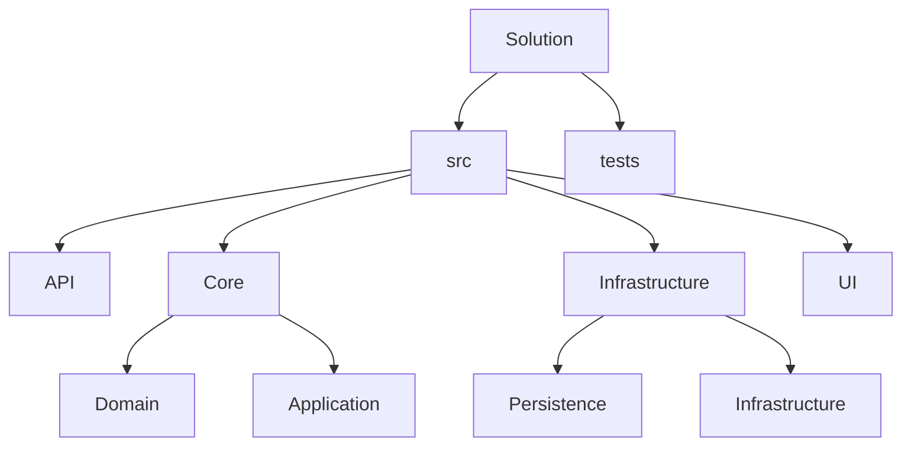

# References

### Application
* **Domain Project**
> * AutoMapper
> * FluentValidation
> * FluentValidation.DependencyInjectionExtensions
> * MediatR
> * Microsoft.Extensions.Logging.Abstraction
  
### Persistence
* **Application Project**
> * Microsoft.EntityFrameworkCore.SqlServer
> * Microsoft.Extensions.Options.ConfigurationExtensions

### Infrastructure
* **Application Project**
> * Microsoft.Extensions.Http
> * Microsoft.Extensions.Options.ConfigurationExtensions
> * System.ServiceModel.Http
  
### API
* **Application Project**
* **Persistence Project**
* **Infrastructure Project**
> * Asp.Versioning.Mvc.ApiExplorer
> * MediatR
> * Microsoft.Data.SqlClient
> * Microsoft.EntityFrameworkCore.Tools
> * Serilog
